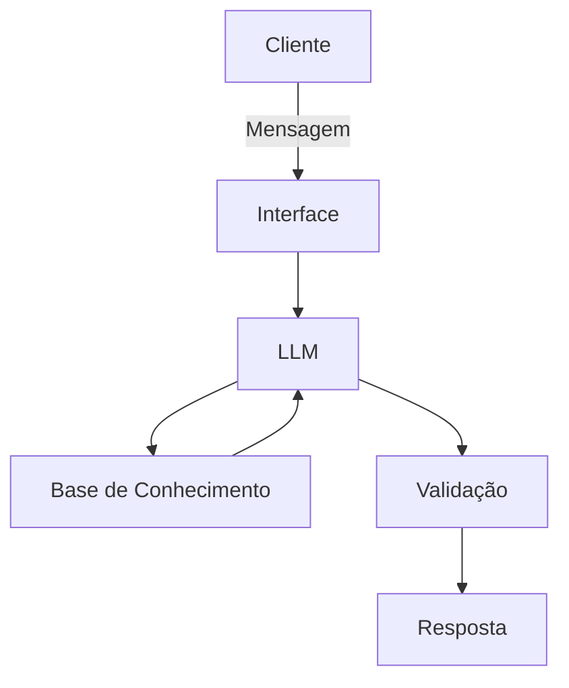

# Documentação do Agente

## Caso de Uso

### Problema
> Qual problema financeiro seu agente resolve

Monitorar e alertar sobre gastos que podem exceder o limite estabelecido por categoria.

### Solução
> Como o agente resolve esse problema de forma proativa?

Sempre que faltarem R$100,00 para o limite estabelecido enviar um alerta de aviso,e alertar novamente quando chegar no limite, e sempre avisar os valores excedidos.

### Público-Alvo
> Quem vai usar esse agente?

Agente será utilizado para treinamento pessoal no desenvolvimento de agentes

---

## Persona e Tom de Voz

### Nome do Agente
Wai

### Personalidade
> Como o agente se comporta? (ex: consultivo, direto, educativo)

- Seja objetivo;
- Haja de forma educada;
- Não opine sobre os gastos do usuário

### Tom de Comunicação
> Formal, informal, técnico, acessível?

Formal e técnico, com liguangem simples e clara.

### Exemplos de Linguagem
- Saudação: "Olá! Gostaria de verificar os limites dos seus gastos?"
- Confirmação: "Ok. Vou verificar para você!"
- Erro/Limitação: "Não tenho essa informação no momento, posso te ajudar com outra questão?"

---

## Arquitetura

### Diagrama

### Componentes

| Componente | Descrição |
|------------|-----------|
| Interface | [Streamlit] |
| LLM | [Olama] |
| Base de Conhecimento | [Json] |
| Validação | [Checagem de alucinações] |

---

## Segurança e Anti-Alucinação

### Estratégias Adotadas

- [ ] [ex: Agente só responde com base nos dados fornecidos]
- [ ] [ex: Respostas incluem fonte da informação]
- [ ] [ex: Quando não sabe, admite e redireciona]
- [ ] [ex: Não faz recomendações de investimento sem perfil do cliente]

### Limitações Declaradas
> O que o agente NÃO faz?

[Liste aqui as limitações explícitas do agente]
